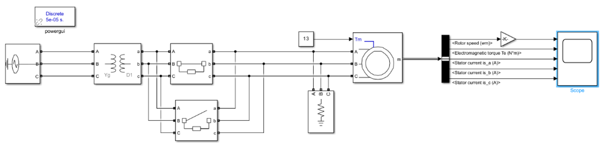
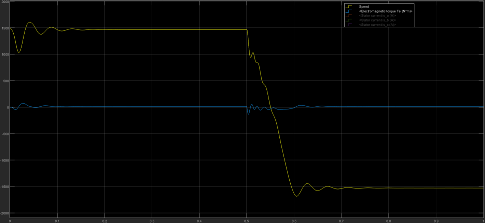
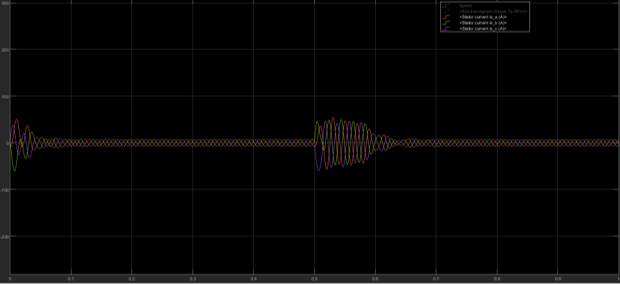
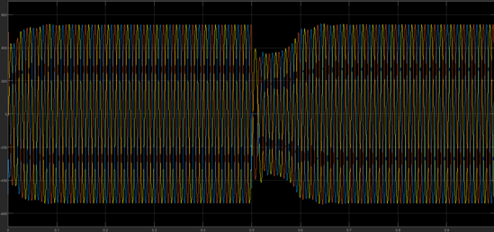

# Three-Phase Induction Motor Direction Reversal

## Overview

This project investigates the direction reversal of a three-phase induction motor using MATLAB/Simulink.

The motor initially operates with the normal three-phase sequence. After startup, two supply phases are swapped to reverse the rotating magnetic field and consequently change the direction of the rotor.

The simulation is used to observe the motor behavior before, during, and after the reversal, including changes in rotor speed, electromagnetic torque, stator current, and stator voltage.

## MATLAB/Simulink Model

The complete system is modeled in MATLAB/Simulink using a three-phase voltage source, transformer, three-phase breakers, and an asynchronous squirrel-cage induction motor.

Motor parameters are configured according to the available motor datasheet.

The simulation runs for 1 second. During the first 0.5 seconds, the motor starts and reaches a stable operating condition. At approximately 0.5 seconds, two phases are exchanged and the motor begins reversing its direction.

## Simulink Circuit

The complete induction motor reversal model is implemented in Simulink using the required electrical and measurement blocks.

## Direction Reversal Method

The direction of rotation of a three-phase induction motor depends on the phase sequence of the supply.

In this design, phases B and C are exchanged using three-phase breaker blocks. Changing the phase sequence reverses the direction of the rotating magnetic field produced by the stator.

As a result:

- Rotor speed decreases from its initial positive value
- Speed passes through zero
- The rotor accelerates in the opposite direction
- Electromagnetic torque changes sign during reversal
- A transient increase in stator current occurs

## Simulation Results

### Speed and Electromagnetic Torque

The speed response shows the motor reaching a stable operating point before the phase sequence is changed.

After the reversal command, rotor speed decreases, crosses zero, and reaches a new steady-state value in the opposite direction. The electromagnetic torque also changes during this transient period.

### Stator Current

A noticeable transient current appears during startup and again when the phase sequence is changed.

This increase is related to the sudden change in the rotating magnetic field and the difference between the new field direction and the mechanical motion of the rotor.

### Stator Voltage

The stator voltage is also monitored during the simulation.

A temporary voltage variation can be observed around the direction reversal due to the transient current and transformer impedance.

## Motor and Supply Parameters

The repository includes the main parameters used in the simulation:

- Induction motor parameters
- Three-phase source parameters
- Transformer configuration
- Transformer electrical parameters

These settings are available in the `Parameters` folder.

## Tools

- MATLAB
- Simulink
- Asynchronous Machine SI Units
- Three-Phase Breaker
- Bus Selector
- Scope

## Repository Structure

- `Simulink_Model` - Main Simulink model and circuit image
- `Parameters` - Motor, source, and transformer settings
- `Results` - Speed, torque, current, and voltage simulation outputs
- `Documentation` - Project report and motor datasheet

## Conclusion

The simulation confirms that swapping two phases of a three-phase supply reverses the direction of rotation of the induction motor.

During the reversal, significant transient effects appear in speed, torque, current, and voltage. After the transient period, the motor reaches a new stable operating condition in the opposite direction.

The results show that phase swapping is a simple and effective method for reversing an induction motor, while the electrical and mechanical transients during reversal should also be considered.
